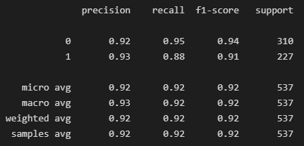
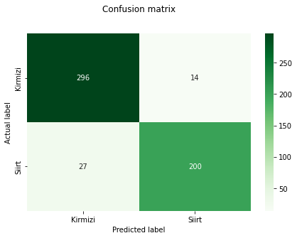

<h1>PYstachio</h1>
<h4><i>A project created by: Group 29 - Iron Giant as a submission requirement for CS180</i></h4>

---
This project contains:
* [A dataset consisting of images of Kirmizi and Siirt Pistachios](Pistachio_Image_Dataset\Pistachio_Image_Dataset)
   * [Also includes data acquired through feature extraction](Pistachio_Image_Dataset\Pistachio_28_Features_Dataset)
* A logistic regression based neural network

<h2>Prerequisites</h2>

---
[requirements.txt](requirements.txt)

<h2>Introduction</h2>

---
**PYstachio** is a machine learning classification model designed to distinguish pistachio species to aid our farmers in classifying their crops. The model uses a **logistic regression based neural network** to clasify two pistachio species based on their shape, color, and morphological features.

<h2>Outline</h2>

---
1. <h3>Fetching the Dataset</h3>
[Fetches the feature extracted data from an arff file](https://docs.scipy.org/doc/scipy/reference/generated/scipy.io.arff.loadarff.html#scipy.io.arff.loadarff) and puts it into a [Pandas dataframe](https://pandas.pydata.org/docs/reference/api/pandas.DataFrame.html?highlight=dataframe#pandas.DataFrame).

2. <h3>Preprocessing</h3>
Prepares the dataset for use in the neural network. First we separate the features from the class (the result), we then [hot encode](https://scikit-learn.org/stable/modules/generated/sklearn.preprocessing.OneHotEncoder.html?highlight=onehotencoder#sklearn.preprocessing.OneHotEncoder) our targets, [split the data into a test and a train set](https://scikit-learn.org/stable/modules/generated/sklearn.model_selection.train_test_split.html?highlight=train_test_split#sklearn.model_selection.train_test_split) and lastly we scale the data using [StandardScaler](https://scikit-learn.org/stable/modules/generated/sklearn.preprocessing.StandardScaler.html) function from scikitlearn.

3. <h3>Model</h3>
Here we describe the model we want to use, in our case a logistic regression based neural network. We define [parameters](https://scikit-learn.org/stable/modules/generated/sklearn.neural_network.MLPClassifier.html?highlight=mlpclassifier#sklearn.neural_network.MLPClassifier) here such as the amount of hidden layers and their amount of nodes, our activation function, our initial learning rate and etc.

4. <h3>Cross-Validation</h3>
This block [cross-validates](https://scikit-learn.org/stable/modules/generated/sklearn.model_selection.cross_validate.html?highlight=cross_validate#sklearn.model_selection.cross_validate) our data through Stratified K-fold cross-validation with our K being 5. It prints our model's accuracy, recall, precision and f1 scores.

5. <h3>Test</h3>
This block uses the test data in order to get our model's predictions on new data it has not seen yet.  It also prints recall, precision and f1 scores.

6. <h3>Classification Report</h3>
Better formatted and more detailed version of test results.

7. <h3>Confusion Matrix</h3>
A confusion matrix of the model's predicted class and their actual class.

<h2>Results</h2>

---
Classification Report:

Confusion Matrix:

<h2>References</h2>

---
1. OZKAN IA., KOKLU M. and SARACOGLU R. (2021). Classification of Pistachio Species Using Improved K-NN Classifier. Progress in Nutrition, Vol. 23, N. 2, pp. DOI:10.23751/pn.v23i2.9686.  (Open Access) https://www.mattioli1885journals.com/index.php/progressinnutrition/article/view/9686/9178

2. SINGH D, TASPINAR YS, KURSUN R, CINAR I, KOKLU M, OZKAN IA, LEE H-N., (2022). Classification and Analysis of Pistachio Species with Pre-Trained Deep Learning Models, Electronics, 11 (7), 981. https://doi.org/10.3390/electronics11070981. (Open Access)